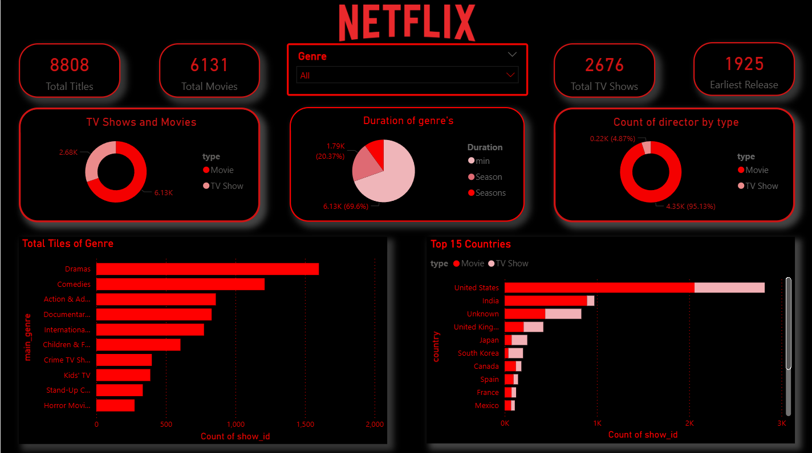

# Netflix Dashboard 2025

## Overview
This project is a **Power BI dashboard** analyzing Netflix data for 2025. It provides insights into popular genres, show ratings, user engagement, and viewing trends over time. The dashboard is interactive, allowing users to explore different metrics and gain actionable insights.

## Objective
- Analyze Netflix data for the year 2025.
- Visualize trends in shows, genres, and ratings.
- Identify top-performing content and viewer engagement patterns.

## Tools Used
- **Microsoft Power BI**

## How to Use
1. Download the `Netflix_Dashboard_2025.pbix` file from this repository.
2. Open it in **Power BI Desktop**.
3. Explore the interactive dashboard to view trends, charts, and insights.

## Dashboard Features
- **Top Genres:** Identify the most-watched genres in 2025.
- **Show Ratings:** Analyze show ratings and viewer feedback.
- **Monthly Trends:** Visualize viewing trends over months.
- **Interactive Filters:** Filter by genre, year, or other metrics.

## Screenshots
*Replace the images below with actual screenshots from your dashboard.*

  

## Key Insights
- Top genres in 2025.  
- Highest-rated shows and movies.  
- Viewing trends and patterns over time.  
- Interactive dashboard allows for deep-dive analysis.

## File
- `Netflix_Dashboard_2025.pbix` – The Power BI dashboard file.
